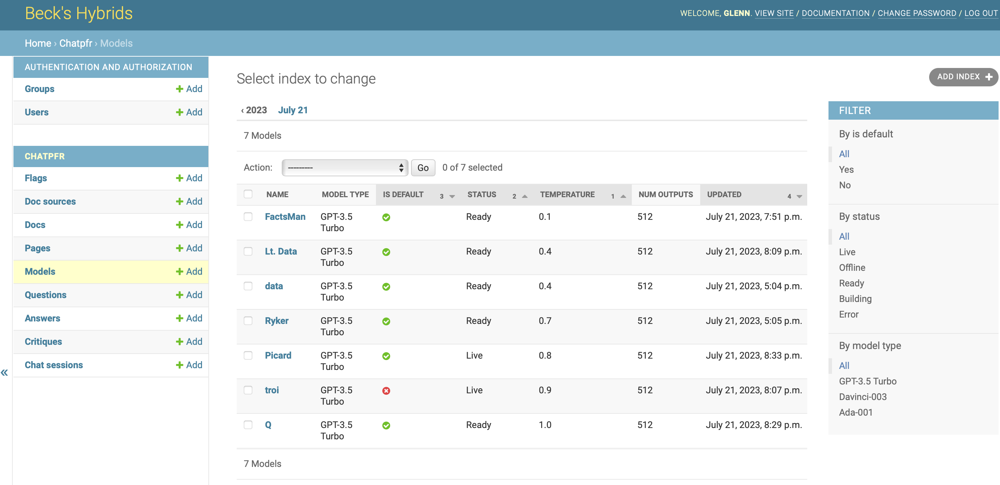
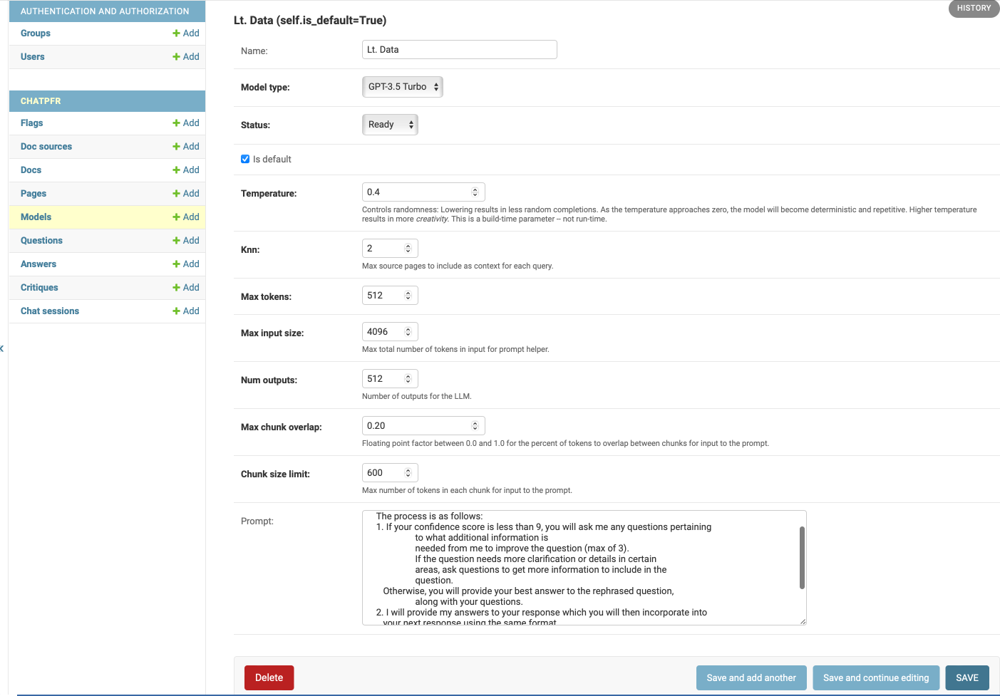
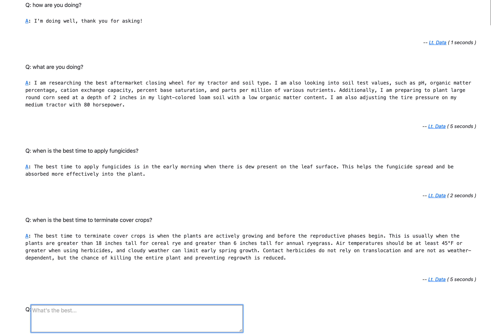

# 🚜 Rally LLM Talk
When: Aug 31, 2023.
Where: Rally Innovation Conference, Downtown Indianapolis
Audience: Entrepreneurs, Founders, VCs, CxO folks
Duration: 30 Minutes

## 👜 General take aways:
- AI is advancing rapidly and getting more and more approachable over time.
- AI can be a threat and/or a multiplier.
- Success of AI projects hinges largely on how well you manage your data.

## 💰 Thar’s gold in them thar hills!

The value in such projects is surfacing data not normally accessed as easily, and possibly even reasoning over such data. 

The hardest work is going to revolve around the quirks of your data.   Is it in scans requiring OCR? In PDFs with wild layouts?  It is tables with heterogeneous column layout within the tables?  Hiding behind an API? If you are working only with LLMs then you will need to reduce everything to a format the LLM can use which can be challenging.

In general the workflow is to gather documents from doc sources, split those documents into logical chunks, then further into physical textual chunks, then finally into tokenized embeddings of the physical chunks.  We use search over the physical chunks to find logical chunks which can be assembled as part of the context passed to OpenAI to generate the answers.

## 🌈 😿 First-mover disadvantage

We started this when LangChain and llama-index were both young.  But as they evolved they began overlapping each other.

If I were starting over, I’d likely stick with LangChain and its ecosystem, possibly Simon’s llm and gpt4all and let them worry about library compatibility.  It feels like every quarter the effort required is halved.

## 🤳 New phone, who dis?

The core of the LLM projects we’ve had are really search projects wrapped in a natural language interface.   Each of this type of project really revolves around how you are going to gather your proprietary data and tell the AI about it.

The UI generally doesn’t need to be much beyond a single text input.

Once we sorted out where get the proprietary information, the major obstacles were around cataloging the information as language, and then the llm and indexing parameters.

## 👻 To whom am I talking?  Are they in the room now?

We created ‘personalities’ with their own system prompts and index/retrieve strategies.

And we collected every question and answer.
Questions could have many answers, and answers could have many critiques.

Questions had the original question and possibly an expert answer against which we could judge the AI answers.

Answers keep track of which AI/index answered each question along with stats on the performance and cost.

This let us replay sessions against different AI configuration and compare their performance.

On the human side, we tracked chat sessions of questions and answers and had persistent memories of facts that the AI could consult across sessions.

All of this is bundled up in Django application using the admin so that new AIs, doc sources and critiques could be added added through the web. 

The chat interface is a simple session history with an input box at the bottom.
Slash commands are enabled for meta actions like starting new sessions, switching and debugging sessions and other meta commands like /remember, /forget and /braindump.

This is all largely a generic low-cost approach that can be applied across similar projects where the goal is to get an AI interface to proprietary data.

## 🕶️ What’s it look like?

Since the chat interface is really just a list and box embedded on a page, 
we went with the second simplest approach of using HTMX to get a dynamic UI that can be built 
on the server side or the client side.  
Basically we wanted the reactive experience of a single page app with the development timeline 
of a server-side generated UI.

## 🚧 🛠️ I wanna play.  What’s the easiest way to start?
How complex at this stage?   pyenv? venv? docker? docker-compose? k8s?

This presentation is in a repo that has a docker-compose file that will bring up a full environment with all the bells and whistles.  It is a bit of a beast, but it is the easiest way to get started.
https://github.com/sixfeetup/rally-llm-presentation

Once checked out, run:

   $ make check

   $ make setup

   $ source ./.langchain_venv/bin/activate

