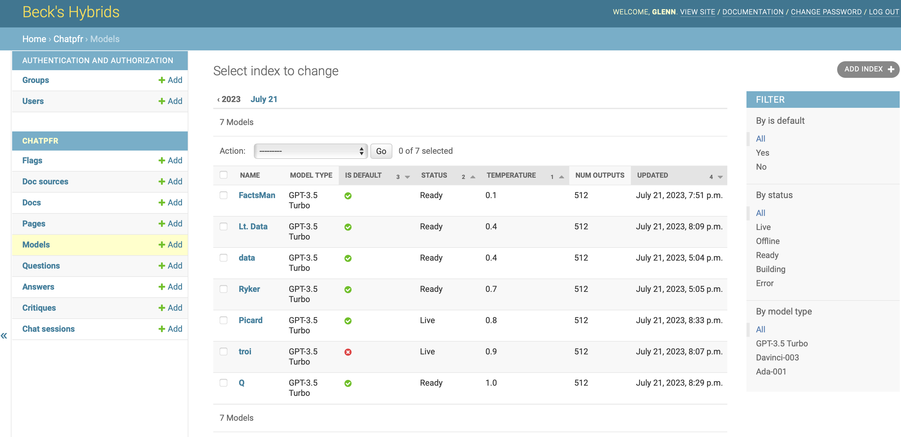
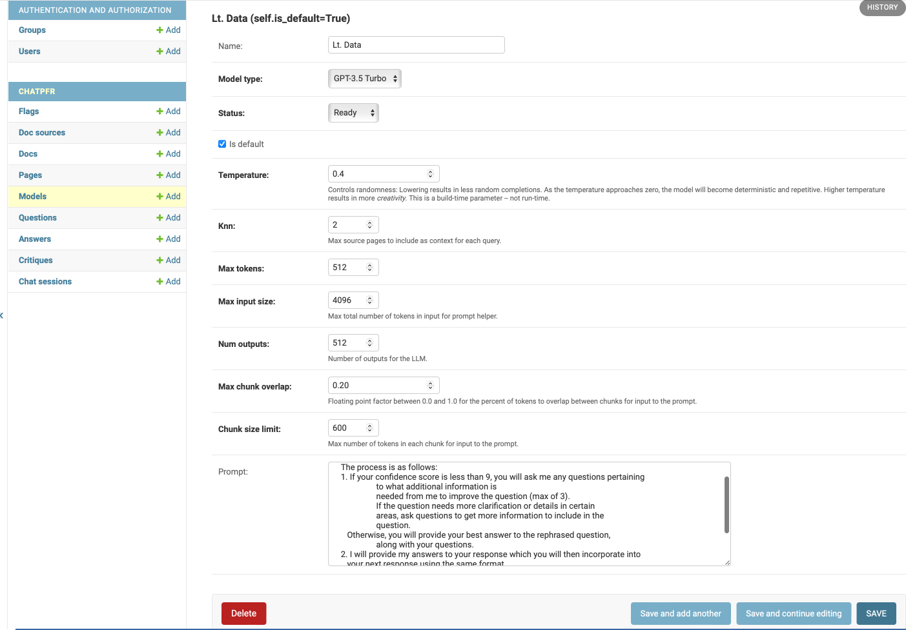
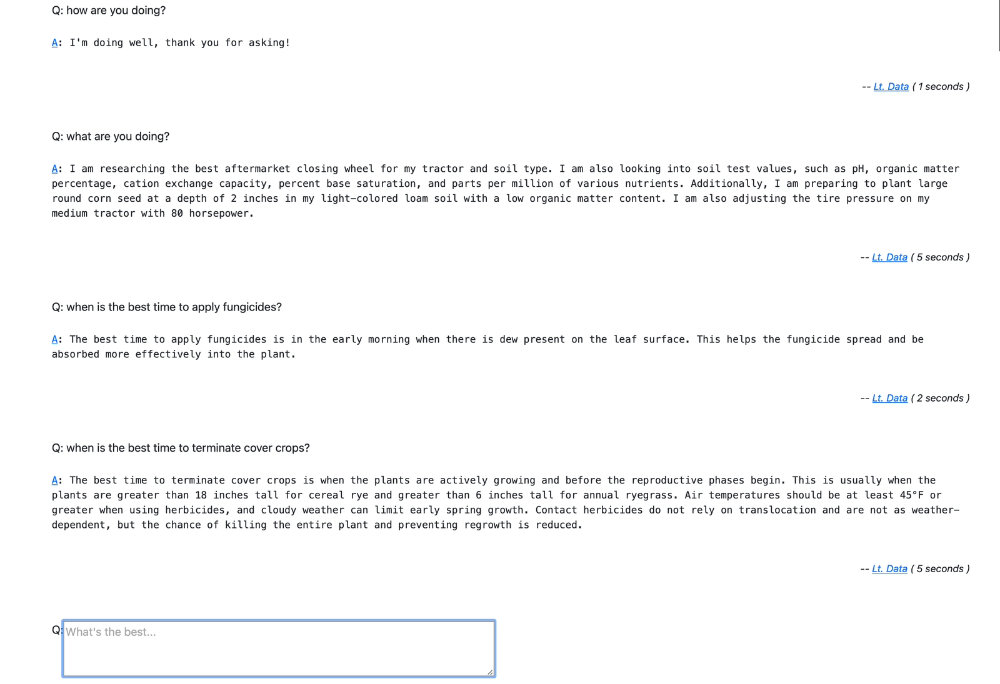

# INNOVATE WITH AI: {.semi-filtered data-background-image="images/B7XpSriA.jpg"}
## BUILD ChatGPT-LIKE APPS
#### Calvin Hendryx-Parker, CTO
#### Six Feet Up


::: notes
- AI is advancing rapidly and getting more and more approachable over time.
- AI can be a threat and/or a multiplier.
- Success of AI projects hinges largely on how well you manage your data.
:::

# GitHub Repository

<https://github.com/sixfeetup/rally-llm-presentation>


# Today's AI Journey {data-background-image="images/kzAAyIEQ.jpg"}

- AI: both a threat and a multiplier
- Data management: the 🗝️ to success
- Build together: live demo 

# Dealing with Data: {data-background-image="images/CXVnDnQA.jpg"}
## Digging for Gold 💰


- Data has quirks: scans, PDFs, tables, oh my! 
- How can you make your data readable for an LLM?

::: notes
The value in such projects is surfacing data not normally accessed as easily, and possibly even reasoning over such data.

The hardest work is going to revolve around the quirks of your data.   Is it in scans requiring OCR? In PDFs with wild layouts?  It is tables with heterogeneous column layout within the tables?  Hiding behind an API? If you are working only with LLMs then you will need to reduce everything to a format the LLM can use which can be challenging.

In general the workflow is to gather documents from doc sources, split those documents into logical chunks, then further into physical textual chunks, then finally into tokenized embeddings of the physical chunks.  We use search over the physical chunks to find logical chunks which can be assembled as part of the context passed to OpenAI to generate the answers.
:::

# What's in your tech stack? {data-background-image="images/5EbEaLGg.jpg"}

- LangChain + Simon’s llm + gpt4all = 🤩

::: notes
We started this when LangChain and llama-index were both young. But as they evolved, they began overlapping each other.

If I were starting over, I’d likely stick with LangChain and its ecosystem, possibly Simon’s llm and gpt4all and let them worry about library compatibility. It feels like every quarter, the effort required is halved.
:::

# LLM: Search Meets Natural Language {data-background-image="images/K458Yj8g.jpg"}

- A simple UI
- Challenges?
    - Cataloging the information as language
    - Indexing parameters

::: notes
The core of the LLM projects we’ve had are really search projects wrapped in a natural language interface.   Each of this type of project really revolves around how you are going to gather your proprietary data and tell the AI about it.

The UI generally doesn’t need to be much beyond a single text input.

Once we sorted out where get the proprietary information, the major obstacles were around cataloging the information as language, and then the llm and indexing parameters.
:::

# Testing Accuracy



::: notes
We created ‘personalities’ with their own system prompts and index/retrieve strategies.
:::

# Testing Accuracy



::: notes
And we collected every question and answer.
Questions could have many answers, and answers could have many critiques.

Questions had the original question and possibly an expert answer against which we could judge the AI answers.

Answers keep track of which AI/index answered each question along with stats on the performance and cost.

This let us replay sessions against different AI configuration and compare their performance.

On the human side, we tracked chat sessions of questions and answers and had persistent memories of facts that the AI could consult across sessions.

All of this is bundled up in Django application using the admin so that new AIs, doc sources and critiques could be added added through the web.


The chat interface is a simple session history with an input box at the bottom.
Slash commands are enabled for meta actions like starting new sessions, switching and debugging sessions and other meta commands like /remember, /forget and /braindump.

This is all largely a generic low-cost approach that can be applied across similar projects where the goal is to get an AI interface to proprietary data.

:::

# What does the app look like?



::: notes
Since the chat interface is really just a list and box embedded on a page,
we went with the second simplest approach of using HTMX to get a dynamic UI that can be built
on the server side or the client side.  
Basically we wanted the reactive experience of a single page app with the development timeline
of a server-side generated UI.
:::

# Build your own ChatGPT {data-background-image="images/j2WhopCA.jpg"}

Bring up a full environment with all the bells and whistles 👇
<https://github.com/sixfeetup/rally-llm-presentation>

Once checked out, run:

```console
$ make check
$ make setup
$ source ./.langchain_venv/bin/activate
... or ...
$ source ./.llm_venv/bin/activate
```

# Questions {data-background-image="images/oI22JNDH.png"}

📩 <calvin@sixfeetup.com>  
🤝 <https://linkedin.com/in/calvinhp>  
✖️ [@calvinhp](https://x.com/calvinhp)  
🐘 [@calvinhp@fosstodon.org](https://fosstodon.org/@calvinhp)  
✍️ <https://sixfeetup.com/blog>
